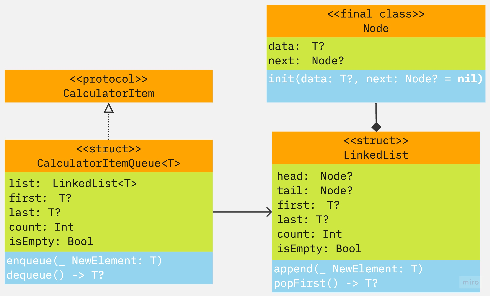

# 계산기

## 목차
[1. 제목](#1-제목)  
[2. 소개](#2-소개)  
[3. 팀원](#3-팀원)  
[4. 타임라인](#4-타임라인)  
[5. UML](#5-UML)  
[6. 실행 화면(기능 설명)](#6-실행-화면(기능-설명))  
[7. 트러블 슈팅](#7-트러블-슈팅)  
[8. 참고 링크](#8-참고-링크)  
[9. 팀회고](#9-팀회고)  

## 1. 제목
- 계산기
## 2. 소개
- 연산 우선순위를 적용하지 않은 계산기 입니다.

## 3. 팀원
|redmango|
|:------:|
||
|Driver, Navigator|
|https://github.com/redmango1447 |

## 4. 타임라인
|날짜|내용|
|:--:|--|
|2023.05.30.| 큐 자료구조 구현을 위한 타입 및 메서드 생성(TDD적용)|
|2023.05.31.| 미흡한 테스트 코드 수정|
|2023.06.01.| LinkedList를 이용한 자료구조 구현을 위한타입 및 메서드 생성(TDD적용)|
|2023.06.02.| 일부 변수 추가 및 테스트|

## 5. UML

<details>
<summary>STEP 1 UML</summary>
<div markdown="1">



</div>
</details>


## 6. 실행 화면(기능 설명) - 추후 추가 예정
<br>


## 7. 트러블 슈팅
### 1. Queue 자료구조 구현 방식
#### 🟧 문제점
swift에는 큐 자료구조를 제공해 주지 않기 때문에 직접 구현을 해야 했습니다.
큐를 구현하기 위한 방법에는 크게 배열을 이용한 방법, 더블 스택을 이용한 방법, List 자료구조를 이용한 방법이 있었습니다. 다만 배열을 이용한 방법은 over head가 발생할 가능성이 있고 더블 스택을 이용한 방법은 reversed를 이용해 반전한 첫 번째 스택을 두 번째 스택에 넣는 과정에서 시간 복잡도가 O(n)이 되기 때문에 부적합하다고 판단했습니다. 마찬가지로 LinkedList의 경우에도 값을 추가할 때 head를 맨 뒤의 Node까지 순차적으로 이동해 값을 넣어야 하기 때문에 시간 복잡도가 O(n)이 되고, 그렇기에 부적합하다고 판단했습니다.
#### 🟩 해결책
배열과 더블 스택을 이용한 방법은 구조적인 문제이지만 LinkedList의 경우 항상 마지막 Node를 가리키는 tail을 추가해 주면 값을 추가할 때 tail을 이용해 바로 추가해줄 수 있기 때문에 시간 복잡도가 O(n)이 되는 문제를 해결할 수 있습니다. 그렇기에 LinkedList를 이용해 큐를 구현했습니다.

```swift
final class LinkedList<T> {
    private var head: Node<T>?
    private var tail: Node<T>?
    
    func append(_ NewElement: T) {
        let newData = Node(data: NewElement)
        
        if head == nil {
            head = newData
            tail = newData
            return
        }
        
        tail?.next = newData
        tail = newData
    }
    
    func popFirst() -> T? {
        guard let data: T = head?.data else {
            return nil
        }
        
        head = head?.next
        
        return data
    }
```

### 2. 음수의 parse
#### 🟧 문제점
기존엔 음수를 고려하지 못하고 아래와 같이 코드를 구현했습니다.
```swift
    input.compactMap{ Operator(rawValue: $0) }.forEach{ formula.operatos.enqueue($0) }
```
하지만 이렇게 문자열의 문자를 하나하나 체크할 경우 `1` `-` `-1`이라는 값이 들어 왔을때 `-1`의 `-`도 연산자 큐에 추가 되어 에러를 불러 일으키는 원인이 되었습니다.
#### 🟩 해결책
첫 해결책은 이미 공백을 기준으로 잘려서 반환되는 `inputStrings`라는 `Stirng`타입의 배열을 활용해 요소의 길이가 1이면 `character`로 변환 한 뒤 `Operator`의 `rewValue`와 매칭시켜 일치하면 연산자 큐에 추가해주는 방식이였습니다. `character`의 변환은 문자열이면 크러쉬가 나게 됨으로 앞에서 미리 체크를 해줘야 했습니다.
```swift
    inputStrings
        .filter { $0.count == 1 }
        .compactMap { Operator(rawValue: Character($0)) }
        .forEach { formula.operators.enqueue($0) }
```
하지만 이 경우 다른 사람이 봤을때 무슨 의미의 코드인지 모른다는 점과 숫자라도 1자리수의 숫자라면 `character`로 변환된다는 점에서 좋지 않은 코드라고 피드백으로 받았습니다. 
그 뒤 수정한 코드는 아래와 같습니다.
```swift
    inputStrings
        .filter { Double($0) == nil }
        .compactMap { Operator(rawValue: Character($0)) }
        .forEach { formula.operators.enqueue($0) }
```
`Double`로 변환 했을때 `nil`인 값. 즉 숫자가 아닌 값을 뽑는 방식으로 코드를 수정했습니다. 입력되리라 예상되는 값 중 숫자로 변환되지 않는 값은 연산자 밖에 없다라고 생각했기 때문입니다. 이렇게 수정함으로써 누군가 봐도 무슨 의미인지 좀 더 파악하기 쉬워졌고 혹시나 숫자가 문자로 변환될 가능성을 막았습니다.

## 8. 참고 링크 - 추후 추가 예정
[공식문서 - nestedtypes](https://docs.swift.org/swift-book/documentation/the-swift-programming-language/nestedtypes/)
[공식문서 - protocols](https://docs.swift.org/swift-book/documentation/the-swift-programming-language/protocols/)
[공식문서 - extensions](https://docs.swift.org/swift-book/documentation/the-swift-programming-language/extensions/)
[공식문서 - generics](https://docs.swift.org/swift-book/documentation/the-swift-programming-language/generics)
[공식문서 - methods:TypeMethods](https://docs.swift.org/swift-book/documentation/the-swift-programming-language/methods#Type-Methods)


## 9. 개인회고
### 잘한 점👍
크게 잘했다고 할만한 점은 이번 스텝에선 느끼지 못했다.

### 개선할 점🤔
몸 관리! 장염덕에 고생도 하고 시간도 딜레이되었다.
