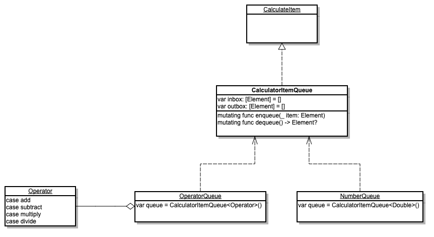
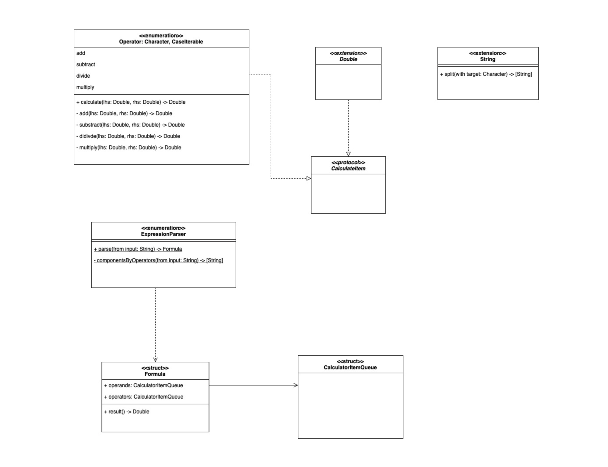

## iOS 커리어 스타터 캠프

### 계산기 프로젝트 저장소

## 프로젝트 소개
1. 숫자 및 기호 버튼을 이용해 연산을 입력합니다.
1. AC버튼은 모든 연산내역을 초기화 하고, CE는 현재 입력하던 숫자나 연산결과만 삭제합니다.
1. +/-버튼으로 숫자의 부호를 변환합니다.
1. 숫자입력중에 연산자(+,−,×,÷)를 누르면 입력을 중지하고 다음 숫자 입력을 받습니다.
1. 숫자입력이 없는 0인 상태에서는 연산자를 반복해서 누르면 연산이 되지 않고 연산자의 종류만 변경합니다.
1. = 버튼을 누르면 입련된 전체 연산을 수행합니다.
1. 0으로 나누면 결과값은 NaN으로 표기합니다.

### 의존모둠 그라운드 룰
- 스크럼
  - 오전(11시~최대 1시간 30분): 어떤 것을 할 것인지, 어떤 것이 막혔는지
  - 오후(17시): 서로 막힌 부분 공유, 감정 공유
  - 활동학습 있는 날은 오후 스크럼만
  - 수요일 No 스크럼
- 커뮤니케이션
  - 솔직하게 의사소통하자

### 프로젝트 일정
1) 1주차 - STEP1
    - 11/08 (월)
      - 그라운드 룰 설정
      - 스크럼 (오늘 할일, 컨디션/감정/일정 공유)
      - GitHub Issue, Milestones, Projects 생성
      - TDD 학습 및 STEP1 구상
    - 11/09 (화) - STEP1 PR 요청
      - 스크럼 (어제 한 일/오늘 할 일, 컨디션/감정/일정 공유)
      - 테스트 코드 포함 전체 코드 구현
      - UML 작성
      - README 작성
    - 11/10 (수)
      - 클로저 학습
    - 11/11 (목)
      - 스크럼
      - PR 피드백 확인 후 리팩토링
    - 11/12 (금)
      - 스크럼
      - STEP2 구현 시작
    - 11/13 (토)
      - ExpressionParser 내부 구현
    - 11/14 (일)
      - calculate, result 메서드 구현

2) 2주차 - STEP2
    - 11/15 (월) - STEP2 PR 요청
      - 스크럼
      - README 작성
      - STEP2 최종 수정

## STEP1
### 구현 내용
 - TDD를 위한 각 테스트 케이스 생성
 - CalculateItem 빈 프로토콜 생성
 - CalculateItem을 채택하는 CalculatorItemQueue 구조체 생성
 - CalculatorItemQueue은 연산자와 숫자 Queue에서 모두 사용할 수 있도록 Generic 타입으로 생성
  (Queue를 구현하기 위해 Double Stack 방식 사용)
 - Operator 연산자 타입(열거형) 생성

### UML

### 고려사항
* 주요 사용자 정의 타입
	 - CalculatorItemQueue : 여러 요소에서 Queue를 사용하기 위해 타입을 Generic으로 생성하여 각 요소의 타입으로 사용할 수 있도록 구현
* 주요 프로퍼티
   - inbox/outbox : Double Stack으로 Queue를 구현하기 위해 요소가 들어오는 inbox, 내보내는 outbox를 생성함

* 주요 메서드
   - enqueue : element를 inbox에 추가
   - dequeue :  
      1) inbox & outbox가 비어있으면 빼낼 값이 없기 때문에 nil을 반환
      2) inbox에 요소가 있고 outbox가 비어있다면 inbox에 reversed메서드를 사용해 outbox로 할당해준 다음 removeAll메서드로 비워줌
      3) outbox에 removeLast메서드를 사용하면 사실상 Queue의 첫번째 요소가 나오게 됨
  
### 키워드
   - TDD, Unit Test, Queue, Double Stack, Generic, UML 

## STEP2
### 구현 내용
- TDD를 위한 각 테스트 케이스 생성(StringExtensionTest, OperatorTest, ExpressionParserTest, FormulaTest)
- CalculatorItemQueue의 요소가 CalculateItem 프로토콜을 채택(Double, Operator)
- Formula 구조체 생성
- ExpressionParser 타입 (열거형) 생성
 - Operator 내부 메서드(calculate, add, subtract, divide, multiply) 추가
- CalculatorError 에러 타입(열거형) 생성
	 
### UML

### 고려사항
* 주요 사용자 정의 타입
	- Formula: operands, operators 프로퍼티를 각 큐에서 사용할 타입으로 Double, Operator를 지정CalculatorItemQueue타입으로 생성, result메서드를 이용해 연산
	- ExpressionParser: componentsByOperators를 이용해 입력된 String에서 숫자를 분리, parse내부에서 입력된 String을 숫자와 연산자를 분리하여 Formula인스턴스를 생성하여 리턴
	- Operator: calculate내부 add, subtract, divide, multiply메서드 호출
	- CalculatorError: 에러를 관리하기 위한 타입 생성, 추후에 에러 메세지를 출력할 가능성이 있다고 판단하여 LocalizedError 프로토콜 채택

* 주요 프로퍼티
	- operands/opberators : Double, Operator타입으로 CalculatorItemQueue 생성하여 연산자와 피연산자 큐를 관리
	- CheckDequeueImpossible: dequeue가 불가능한 상태인지를 Bool타입으로 return

* 주요 메서드
	- dequeue: 기존 inbox & outbox가 비어있으면 nil을 반환하는 로직에서 에러를 던져주도록 수정
	  	(nil을 반환하는 것 보다 error를 처리하는 것이 더 명확한 의미전달이라고 판단)
	- result: 
		1) 내부에서 dequeue메서드를 호출하여 연산 및 outbox가 빌때까지 반복하여 연산
		2) operands의 갯수가 operators보다 하나 많기 때문에 수식의 첫 값을 dequeue를 해준 뒤 반복문 실행
		3) 에러를 catch하는 부분은 viewController가 될 것이라 예상하여 try만 사용 하여 에러를 던져주도록 구현
	- parse: 
		1) compactMap을 사용하여 원하는 타입으로 변환한 배열을 생성
		2) 변환된 배열을 Formula 이니셜라이저의 매개변수에 넣어 인스턴스 생성&반환
	- componentsByOperators : 
		1) 내부에서 Operator.allCases를 이용해 for-in구문 실행, 
		2) componentsByOneOperator에 연산자를 하나씩 넣고 배열을 새로 만드는 과정을 반복하여 숫자만 들어있는 배열 생성
	- calculate: switch구문을 이용하여 각 연산자에 맞는 메서드 호출

### 키워드
   - TDD, Unit Test, UML, computed property, contorl flow, compactMap, split, map 
