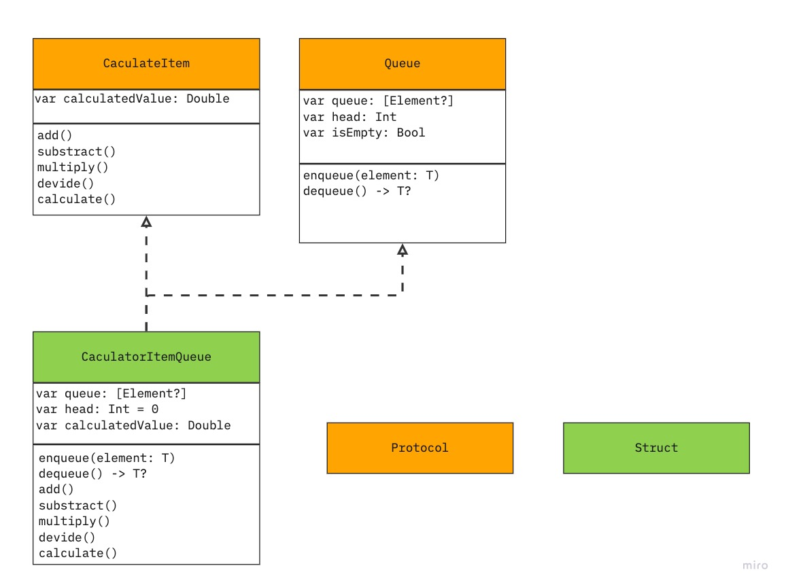

# 계산기

## 목차
[1. 제목](#1-제목)  
[2. 소개](#2-소개)  
[3. 팀원](#3-팀원)  
[4. 타임라인](#4-타임라인)  
[5. UML](#5-UML)  
[6. 실행 화면(기능 설명)](#6-실행-화면(기능-설명))  
[7. 트러블 슈팅](#7-트러블-슈팅)  
[8. 참고 링크](#8-참고-링크)  
[9. 팀회고](#9-팀회고)  

## 1. 제목
- 계산기

## 2. 소개
- 연산 우선순위를 적용하지 않은 계산기 입니다.

## 3. 팀원
|redmango|
|:------:|
||
|Driver, Navigator|    Driver, Navigator|

## 4. 타임라인
|날짜|내용|
|:--:|--|
|2023.05.30.| 큐 자료구조 구현을 위한 타입 및 메서드 생성(TDD적용)|
|2023.05.31.| 미흡한 테스트 코드 수정|
|2023.06.01.| LinkedList를 이용한 자료구조 구현을 위한타입 및 메서드 생성(TDD적용)|
|2023.06.02.| 일부 변수 추가 및 테스트|

## 5. UML

<details>
<summary>STEP 1 UML</summary>
<div markdown="1">



</div>
</details>


## 6. 실행 화면(기능 설명) - 추후 추가 예정


## 7. 트러블 슈팅
### 1. Queue 자료구조 구현 방식
#### 🟧 문제점
swift에는 큐 자료구조를 제공해 주지 않기 때문에 직접 구현을 해야 했습니다.
큐를 구현하기 위한 방법에는 크게 배열을 이용한 방법, 더블 스택을 이용한 방법, List 자료구조를 이용한 방법이 있었습니다. 다만 배열을 이용한 방법은 over head가 발생할 가능성이 있고 더블 스택을 이용한 방법은 reversed를 이용해 반전한 첫 번째 스택을 두 번째 스택에 넣는 과정에서 시간 복잡도가 O(n)이 되기 때문에 부적합하다고 판단했습니다. 마찬가지로 LinkedList의 경우에도 값을 추가할 때 head를 맨 뒤의 Node까지 순차적으로 이동해 값을 넣어야 하기 때문에 시간 복잡도가 O(n)이 되고, 그렇기에 부적합하다고 판단했습니다.
#### 🟩 해결책
배열과 더블 스택을 이용한 방법은 구조적인 문제이지만 LinkedList의 경우 항상 마지막 Node를 가리키는 tail을 추가해 주면 값을 추가할 때 tail을 이용해 바로 추가해줄 수 있기 때문에 시간 복잡도가 O(n)이 되는 문제를 해결할 수 있습니다. 그렇기에 LinkedList를 이용해 큐를 구현했습니다.

```swift
final class LinkedList<T> {
    private var head: Node<T>?
    private var tail: Node<T>?
    
    func append(_ NewElement: T) {
        let newData = Node(data: NewElement)
        
        if head == nil {
            head = newData
            tail = newData
            return
        }
        
        tail?.next = newData
        tail = newData
    }
    
    func popFirst() -> T? {
        guard let data: T = head?.data else {
            return nil
        }
        
        head = head?.next
        
        return data
    }
```


## 8. 참고 링크 - 추후 추가 예정


## 9. 팀회고
### 우리팀이 잘한 점👍

### 우리팀 개선할 점🤔

### 서로에게 좋았던 점 피드백
#### To. 

#### To. redmango


### 서로에게 아쉬웠던 점 피드백
#### To. 

#### To. redmango
