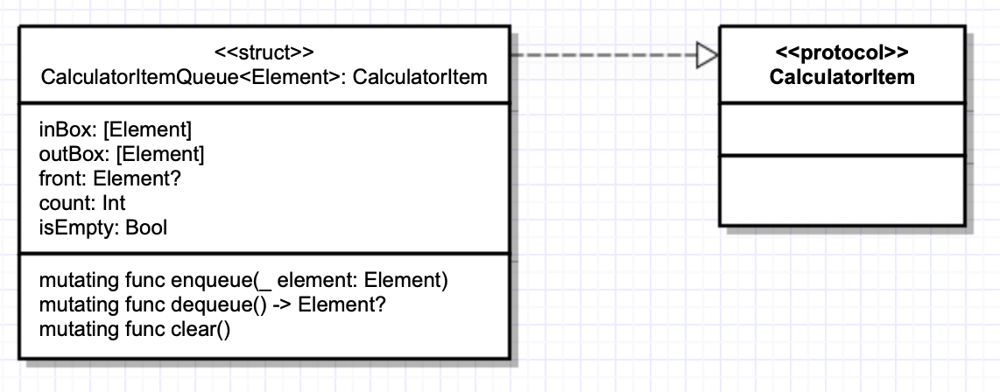
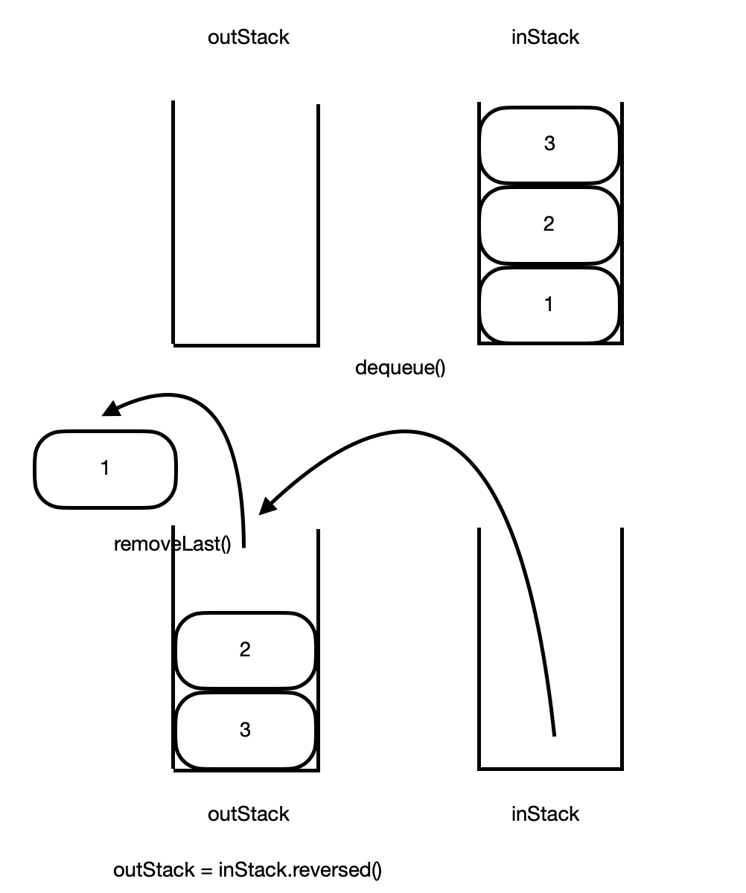

# 🧮 계산기

> 계산이요.

</br>

**Index**
- [Preview](#Preview)
- [Ground Rule](#GroundRule)
- [Time Line](#TimeLine)
- [Step1](#Step1)
- [Step2](#Step2)

</br>

<a name="Preview"></a>
# 🎞 Preview

  Calculate                |  Divide to 0              |  Auto Scroll
:-------------------------:|:-------------------------:|:-------------------------:
  |  |

</br>

<a name="GroundRule"></a>
# 🤝 Ground Rule

### Commit Convention

- [Karma Style](http://karma-runner.github.io/latest/dev/git-commit-msg.html)

### 기타

- **수요일**은 되도록이면 프로젝트에 손을 대지않고, 프로젝트를 통해 알게된 것이나, 기타 사항으로 알게된 것을 정리하는 시간을 가진다.
- 구현 전 **Issue**를 생성하며 요구사항에 대해 한번 더 생각해본다.

</br>

<a name="TimeLine"></a>
# ⏰  타임 라인

<details>
<summary>Week 1</summary>
<div markdown="1">       

  <details>
<summary>21.11.08.Mon</summary>
<div markdown="1-1">       

- Step1 요구사항 파악
- Queue, LinkedList 자료구조 공부
- TDD 복습
- 테스트 타겟 설정 및 초기 타입 구현
- Step1 기한 설정

</div>
</details>

<details>
<summary>21.11.09.Tue</summary>
<div markdown="1-2">       

- UML 작성
- Queue 구현
- TDD 방식으로 Queue Test
- 코드 Refactoring
- Step1 PR 제출
- README.md 작성

</div>
</details>

<details>
<summary>21.11.11.Thu</summary>
<div markdown="1-3">       

- Step2 요구사항 파악
- 모델 파일 생성 및 분류
- Operator enumeration 구현

</div>
</details>

<details>
<summary>21.11.12.Fri</summary>
<div markdown="1-4">       

- TDD 방식으로 코드 작성
- Queue 테스트 코드 리팩터링
- Operator 테스트 코드 작성 및 리팩터링
- Formula 구조체 테스트 코드 작성 및 내부 구현
- ExpressionParser 테스트 코드 작성 및 내부 구현

</div>
</details>

<details>
<summary>21.11.13.Sat</summary>
<div markdown="1-5">       

- ExpressionParser 테스트 코드 작성 및 리팩터링
- 파일 재분류
  
</div>
</details>

<details>
<summary>21.11.14.Sun</summary>
<div markdown="1-6">       

- 주석 제거
- 에러 타입 구현
- 오류 처리 구현
- Operator 분리 메소드 및 테스트 코드 리팩터링
  
</div>
</details>

</div>
</details>

<details>
<summary>Week 2</summary>
<div markdown="2">       

<details>
<summary>21.11.15.Mon</summary>
<div markdown="2-1">       

- README.md 업데이트
- 코드 중복성 판단 후 수정
  
</div>
</details>

<details>
<summary>21.11.16.Tue</summary>
<div markdown="2-2">       

- Step2 PR 제출
  
</div>
</details>

<details>
<summary>21.11.17.Wed</summary>
<div markdown="2-3">       

- Step2 피드백 반영 및 리팩터링
- Step3 요구사항 파악
- StackView, Label 동적 생성 구현
- 각 버튼 액션함수 구현
  
</div>
</details>

<details>
<summary>21.11.18.Thu</summary>
<div markdown="2-4">       

- ScrollView 자동 최신화 구현
- 액션 함수 내부 리팩터링
- 함수 세분화, 분리
- 개행 수정
- Step3 PR 제출
  
</div>
</details>

<details>
<summary>21.11.19.Fri</summary>
<div markdown="2-5">       

- README.md 업데이트
  
</div>
</details>

</div>
</details>

</br>

<a name="Step1"></a>
# 1️⃣ Step 1

## 📊 Step1 UML



Step 1 요구사항에 맞게 빈 프로토콜과, Queue 구현

## 🎯 Step1 구현 내용

- TDD를 위한 Test case 생성
- 향후 Step을 위한 빈 프로토콜 `CalculatorItem`
- `CalculatorItem`을 채택하는 `CalculatorItemQueue`생성
- 향후 큐를 여러 타입으로 사용하기 위해 `CalculatorItemQueue`을 Generic 타입으로 생성
- Queue를 DoubleStack 방식으로 구현

## 🤔 Step1 고민했던 점

- 큐 타입을 만들고 다음 스텝에서 구현할 Queue에 만들어놓은 Queue를 써주려했다. 숫자와 연산자의 Queue가 필요하다고 생각하였는데 그러러면 각 타입이 Int, String이여야 했고, 이를 위해 각 타입별 Queue를 만드는 것은 굉장히 비효율적이라고 생각하여 **타입에 제한을 두지않고 재사용하여 코드의 중복도 줄일 수 있는 Generic**을 활용해 Queue 타입을 생성

- Queue 타입은 **구조체**를 택다. 그 이유는 프로토콜만 채택하고, 굳이 상속할 필요도 없고 또한 상속 받을 것도 없었기때문에 이 점때문에라도 클래스를 굳이 택할 이유가 없지않나? 하고 결정

- Generic 타입 파라미터명을 뭐라고 해야하는지 고민되었다. 해당 파라미터명은 보통 T, U, V같은 하나의 대문자를 사용하지만, Array의 경우 Element(요소)와 연관된 의미와 규칙이 있으므로, 명확함을 주기위해 사용된다고 [공식문서]([https://docs.swift.org/swift-book/LanguageGuide/Generics.html#ID183](https://docs.swift.org/swift-book/LanguageGuide/Generics.html#ID183))에서 보았다. 현재 프로젝트에서 생성한 Queue 또한 Element와 관련이 있다고 생각하여 타입 파라미터명을 Element로 지정해주었다.

## 🙇‍♂️ Step1 배운 점

### Genenric

- 타입에 제한을 두지않고 재사용하여 코드의 중복도 줄일 수 있음
- 의도가 명확한 코드를 작성할 수 있다.</br>

### DoubleStack을 이용한 Queue



**Queue**를 하나의 **Array**로 만든다면, 첫번째 요소를 제거하려 ```removeFirst()```를 호출할텐데 공식문서를 보면 **시간복잡도가 O(n)** 인 모습을 볼수 있다.</br>


이는 첫번째 요소가 빠지고 그 뒤의 요소들이 앞으로 당겨지는 과정에서 발생하는 비용으로 인한 것이다.

그래서 그러한 단점을 보완한 **DoubleStack** 즉, **Array** 2개를 이용해 단점을 보완한다

하나의 **Array**에 먼저 **enqueue** 하여 요소를 넣어주고 **dequeue**할 때 다른 Array에 ```reversed()```를 이용하여 넣어준다면 첫번째 배열의 첫번째 요소가 두번째 배열에선 마지막 요소가 되기에 **dequeue**하여 요소를 뺄 때 첫번째 요소를 뺴서 뒤의 요소들이 앞으로 당겨지는 비용이 쓰이지 않게 되어 시간복잡도가 O(1)이 되고, 요소가 많아도 비용이 늘지 않게 되는 것이다.

</br>

<a name="Step2"></a>
# 2️⃣ Step 2

## 📊 Step2 UML


## 🎯 Step2 구현 내용

- TDD를 위한 Test case 생성
- Protocol as Type
</br>

|함수명|기능|
|--|--|
|calculate(lhs:,rhs:)|Queue에서 하나씩 dequeue하여 연산자에 따른 계산 결과 반환|
|split(with target:)|피연산자와 연산자를 나눠 피연산자만 담긴 배열 반환|
|componentsByOperators(from input:)|받은 input을 split을 활용하여 피연산자 배열 반환|
|parse(from input:)| - componentsByOperators을 활용하여 반환된 피연산자 배열을 Double로 형변환하여 Formula의 operandsQueue에 반환 </br> - 받은 input에서 연산자만 걸러내 Formula의 operatorsQueue에 반환|
|result()|parse로 반환 받은 Queue를 이용해 calculate로 연산후 결과 반환|


## 🤔 Step2 고민했던 점

### 흐름파악

흐름을 파악하기 어려웠다. 고민하다 결정한 흐름은 아래와 같다.

1. 받은 식을 ```split()```으로 연산자를 거르고 숫자만 담긴 배열 반환

2. ```componentbyOperators()```에서 받은 input을 ```split()```를 사용하여 숫자 담긴 배열을 반환

3. ```parse()``` 에서 ```componentbyOperators()``` 를 써서 반환된 숫자 배열을 더블로 형변환하여 formula의 숫자큐에 저장, 받은 파라미터에서 연산자만 걸러내 formula의 연산자큐에 저장, formula반환

4. formula에서 받은 큐를 이용해 ```result()``` 에서 결과값 반환

5. 에러 처리 구현

### TDD

TDD 방식으로 진행하며, commit 단위를 고민해보았다.

- 우선 TestCase 작성 후, 이후에 실제 기능을 하는 코드를 리팩터링하며 해당 TestCase가 성공하게 만드는 과정을 거쳤는데, 먼저 TestCase를 작성한 후 ```test:``` 로 커밋한 후 본 코드를 만져 ```feat:```, ```refactor:``` 로 추가해주어야 하는가?

- 아니면 두 과정을 모두 거친 후 ```test:```로 body부분에 세부사항을 작성해 올려줘야 하는가? 

TDD엔 **테스트 실패 -> 테스트 성공 -> 본 코드 리팩터링** 이라는 과정이 있는데 이 세부분 전부를 커밋을 나눠준다면 테스트를 실패한 코드도 커밋 기록에 남는다.

그러기에 세부분을 나눠 커밋하는 것이 아닌 하나의 테스트케이스가 완성되었을 때, 즉 본 코드 **(기능 구현이 된, 테스트가 무조건 성공하는 코드가 아닌)** 와 테스트케이스의 구현이 완료되면 ```test:```로 커밋을 올리고, 이후 본 코드 리팩터링 작업을 하여 ```refactor:```로 커밋을 올리는 방법을 택했다.


## 🙇‍♂️ Step2 배운 점

### Protocol as Type

```swift
protocol CalculateItem { }
```

빈 프로토콜을 활용해 타입으로서의 프로토콜을 정의했다. 제네릭의 요소의 타입이 해당 프로토콜을 준수하는 타입만 받을 수 있게끔 제한을 거는 용도로 사용할 수도 있다는 것을 알게됐다.  

이번 프로젝트에선 큐의 타입에 제한을 거는 용도로 사용하였는데, 확장성을 따지려면 프로토콜로 타입 제한을 건 것을 제거하거나, 사용하고 싶은 타입에 프로토콜을 채택해주면 되지 않을까? 생각했다.

### 요구사항 파악의 중요성

Step2를 진행하며 각 메소드들을 정의하는데 흐름이 파악되지 않아 우선 각 메소드에 대한 기능이라도 생각해봐서 구현해보았다.

하지만 향후 알게된 요구사항대로의 흐름을 파악했을 땐 코드를 다 갈아엎어야되는 경험을 했었다.

이 과정에서 초기 요구사항을 상세히 파악해야하는 이유를 알게되었고, 갑자기 생겨날지 모르는 기획변경, 요구사항 변경 등에 대비해 함수를 세분화 시키고, 재사용성을 높이는 것이 위에서 내가 경험했던 코드를 다 갈아엎는 등의 비용을 낮출 수 있겠다고 느꼈다.

 
 


