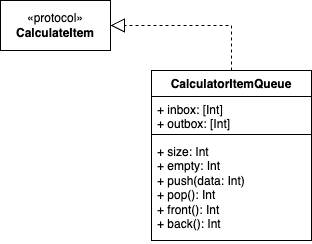

# 계산기 프로젝트
사용자로부터 숫자를 입력 받아 사칙연산을 하는 계산기입니다.

## 🧾 UML
### 클래스 다이어그램

## 🔨 트러블 슈팅 
### `Signing for "Calculator" requires a development team.`
엑스코드 이슈. 저장공간 용량 초과로 이것저것 삭제하다가 사단이 난 것으로 추측되는데, 구글링 결과 개발자 계정을 지정하지 않아서 발생하는 오류였다. [Setting]-[Accounts]에서 Apple 계정을 추가해줬다.
### `Select a development team in the Signing & Capabilities editor.`
이 또한 엑스코드 이슈. 개발자의 서명이 필요하다는 뜻이다. `Signing for "Calculator" requires a development team.` 오류와 연관되어 발생한 것으로 보인다. 프로젝트 에디터를 선택하고, [Signing & Capabilities]-[Signing (Release)]-[Team]에서 새로 지정한 개발자 계정을 선택하여 해결했다.

## 🥷🏿 팀원 
| [gama](https://github.com/forseaest) |
| --- |
|  |

## 📅 타임라인 
| 날짜 | 내용 |
| --- | --- |
| 230212 | [Step1] 단위 테스트 타깃 추가, CalculatorItemQueue UML 작성 및 구현 |
| 230213 | [Step1] PR, 피드백 반영 |
